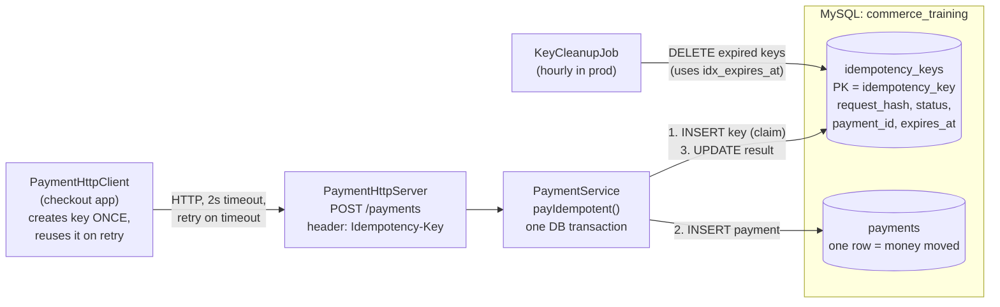
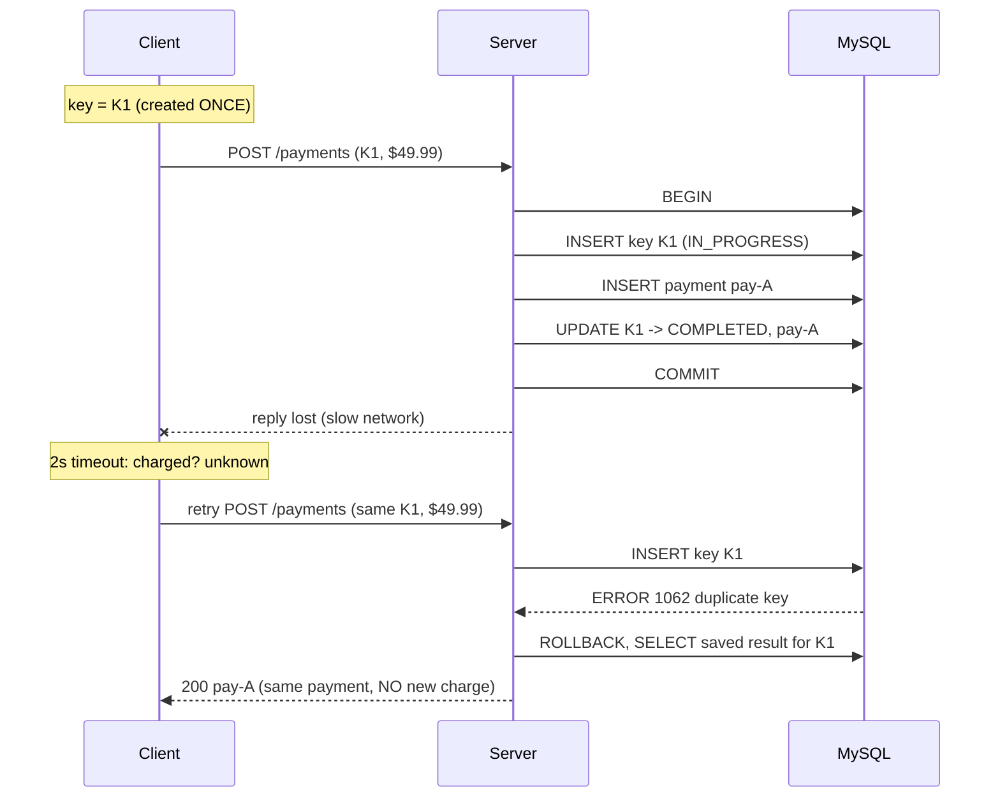
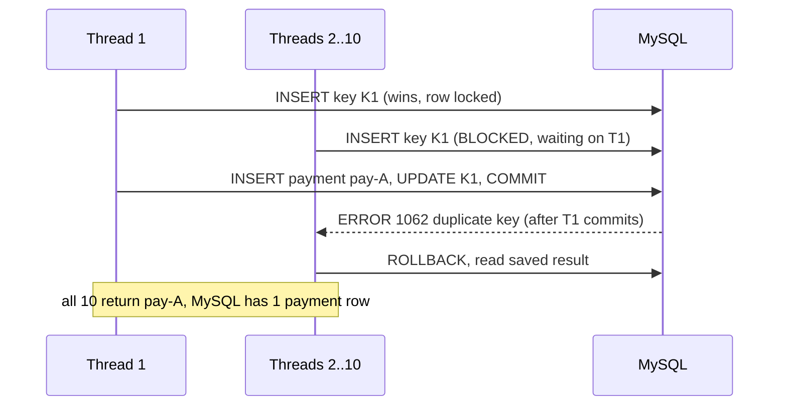
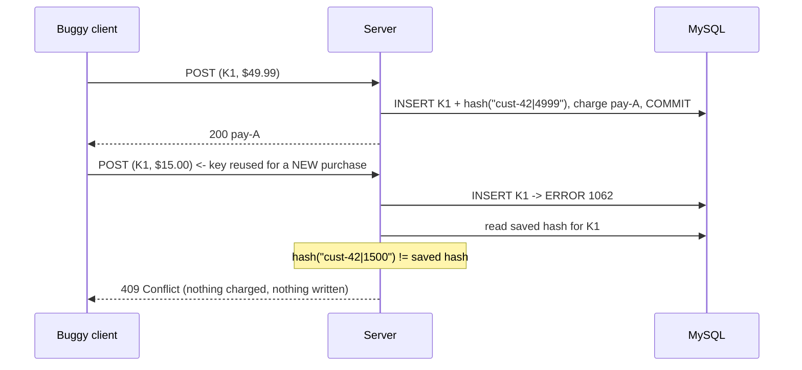
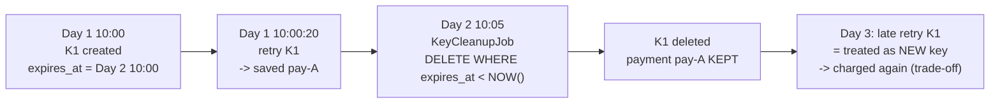

# 01 - Idempotency with MySQL

> **One line:** a payment request can be retried any number of times, over a flaky network,
> from many threads at once, and the customer is still charged **exactly once**.

---

## 1. The problem (why this matters in distributed systems)

In a distributed system the client and the server are on different machines, connected by a network
that can fail at any moment. The worst failure for payments is the **lost response**:

```
Client                          Server
  | --- POST /payments ------->  |  charges $49.99, COMMIT
  |                              |
  |   X  response lost  X  <---  |
  |                              |
  "Did it work? I don't know."
```

The client **cannot tell** "the request never arrived" apart from "it worked but the reply was lost".
It has only two choices, and both are bad without idempotency:

| Client choice | Result without idempotency |
|---|---|
| Don't retry | Customer may never be charged / order lost |
| Retry | Customer may be **charged twice** |

**Idempotency** makes retrying safe: *doing the same operation twice has the same effect as doing it once.*

---

## 2. The solution at a glance

1. The **client** creates a unique **Idempotency-Key** (a UUID) **once per purchase**, and sends the
   **same key on every retry**.
2. The **server** stores the key in a table whose **PRIMARY KEY is the idempotency key**.
   MySQL itself rejects a second row with the same key (error 1062), even under concurrency.
3. Claiming the key, charging, and saving the result happen in **one database transaction**.
4. A retry with the same key gets the **saved result** back, with no new charge.
5. A key reused for a **different request** is refused with **409 Conflict** (request fingerprint).
6. Keys **expire after 24 hours** and are cleaned up by an indexed job.

### Architecture



---

## 3. How it works: the four key flows

### Flow A - Lost response + retry (the core scenario, Step 6)



### Flow B - 10 identical requests at the same instant (Step 7b)



No Java locks are needed: the **PRIMARY KEY + InnoDB row lock** serialize the race.
If Thread 1 had rolled back instead, one waiter's INSERT would succeed and it would do the charge.
Either way: **never more than one charge**.

### Flow C - Same key, different request (Step 7a)



Without this check the server would return `pay-A` for the $15 purchase: the client believes it paid,
but nothing was charged. **Fail loudly instead of guessing with money.**

### Flow D - Key expiry (Step 7c)



**Trade-off:** key lifetime must be **longer than any client's retry window**.
Real APIs document it ("keys are kept for 24 hours") so clients never retry after that.

---

## 4. Data model

```sql
CREATE TABLE payments (                      -- money moved; kept forever
    payment_id    VARCHAR(40)  PRIMARY KEY,
    customer_id   VARCHAR(40)  NOT NULL,
    amount_cents  INT          NOT NULL,     -- money as integer cents, never double
    status        VARCHAR(20)  NOT NULL,
    created_at    TIMESTAMP(3) NOT NULL DEFAULT CURRENT_TIMESTAMP(3)
);

CREATE TABLE idempotency_keys (              -- short-term memory for retries
    idempotency_key  VARCHAR(64)  PRIMARY KEY,   -- THE guard against duplicates
    request_hash     CHAR(64)     NOT NULL,      -- SHA-256("customerId|amountCents")
    status           VARCHAR(20)  NOT NULL,      -- IN_PROGRESS -> COMPLETED
    payment_id       VARCHAR(40)  NULL,          -- saved result returned to retries
    created_at       TIMESTAMP(3) NOT NULL DEFAULT CURRENT_TIMESTAMP(3),
    expires_at       TIMESTAMP(3) NOT NULL,      -- created_at + 24h
    INDEX idx_expires_at (expires_at)            -- fast cleanup
);
```

| Index | Answers the question | Used by |
|---|---|---|
| `PRIMARY (idempotency_key)` | "Does key K1 already exist?" | every payment request |
| `idx_expires_at` | "Which keys have expired?" | hourly cleanup job |

---

## 5. Distributed-systems concepts covered

| Concept | What it means | Where in this POC |
|---|---|---|
| **Idempotency** | Repeating an operation has the same effect as doing it once | `payIdempotent` |
| **At-least-once delivery** | Over a network, retries mean a request may arrive more than once | `PaymentHttpClient` retry loop |
| **Exactly-once *effect*** | At-least-once delivery + idempotent processing = charged once | whole POC |
| **Lost response / unknown outcome** | Timeout does not mean failure; the work may have happened | Step 6 (server sleeps after commit) |
| **Atomicity (ACID transaction)** | Key + payment + result commit together or not at all | `setAutoCommit(false)` ... `commit()` |
| **Uniqueness constraint as a lock** | The DB, not app code, decides who is first | PRIMARY KEY + error 1062 |
| **Check-then-act race condition** | `SELECT` then `INSERT` lets two requests both "see empty" | why we INSERT first instead |
| **Concurrency control (row locks)** | Duplicates wait for the first transaction, then see its result | Step 7b, 10 threads |
| **Request fingerprinting** | Distinguish a true retry from key misuse | `request_hash`, 409 Conflict |
| **TTL / data lifecycle** | Dedup state is temporary; business records are permanent | `expires_at` + `KeyCleanupJob` |
| **Client/server contract** | Client must reuse the key; server must require it (400 if missing) | `PaymentHttpServer` |

---

## 6. Build history (one commit per step)

| Step | What was built | What it proved |
|---|---|---|
| 1 | Repo + folders | - |
| 2 | Maven, `Db`, `ConnectionCheck` | Java <-> MySQL; password via env var, never in git |
| 3 | Schema + `UniqueKeyDemo` | MySQL rejects a duplicate key (error 1062) |
| 4 | `payNaive` + `NaiveRetryDemo` | **The bug:** retry = 2 charges |
| 5 | `payIdempotent` + `IdempotentRetryDemo` | **The fix:** retry returns the same payment, 1 row |
| 6 | `PaymentHttpServer` + `PaymentHttpClient` | Real timeout over HTTP, safe retry with the same key |
| 7a | `request_hash` + 409 | Key reused for a different request is refused |
| 7b | `ConcurrentRetryDemo` | 10 simultaneous duplicates -> exactly 1 charge |
| 7c | `idx_expires_at` + `KeyCleanupJob` | Keys expire; payments are never deleted |

---

## 7. How to run (Windows PowerShell)

```powershell
$env:DB_PASSWORD = "<poc_user password>"          # once per terminal

# reset tables
mvn -q compile exec:java "-Dexec.mainClass=com.teja.pocs.idempotency.SchemaSetup"

# bug vs fix (in-process)
mvn -q exec:java "-Dexec.mainClass=com.teja.pocs.idempotency.NaiveRetryDemo"
mvn -q exec:java "-Dexec.mainClass=com.teja.pocs.idempotency.IdempotentRetryDemo"

# concurrency: 10 threads, 1 charge
mvn -q exec:java "-Dexec.mainClass=com.teja.pocs.idempotency.ConcurrentRetryDemo"

# real HTTP: terminal 1 = server, terminal 2 = client
mvn -q exec:java "-Dexec.mainClass=com.teja.pocs.idempotency.PaymentHttpServer"
mvn -q exec:java "-Dexec.mainClass=com.teja.pocs.idempotency.PaymentHttpClient"

# manual checks with curl (same key, then different amount -> 409)
curl.exe -i -X POST -H "Idempotency-Key: K1" "http://localhost:8080/payments?customerId=cust-42&amountCents=4999"
curl.exe -i -X POST -H "Idempotency-Key: K1" "http://localhost:8080/payments?customerId=cust-42&amountCents=1500"

# expire + clean up keys
mvn -q exec:java "-Dexec.mainClass=com.teja.pocs.idempotency.KeyCleanupJob"
```

---

## 8. Interview prep: questions and crisp answers

**Q1. What is idempotency and why do payments need it?**
Doing an operation twice has the same effect as once. Networks force retries (lost responses,
timeouts), so without idempotency a retry can charge the customer twice.

**Q2. Who generates the idempotency key, and when?**
The **client**, once per purchase intent, **before** the first attempt, and it reuses it on every retry.
Only the client knows whether two requests are the same purchase.

**Q3. Why not `SELECT` first and `INSERT` if not found?**
Check-then-act race: two concurrent requests both see "not found" and both charge. Instead, INSERT
first and let the PRIMARY KEY decide atomically who is first.

**Q4. Why one transaction?**
If the server crashes between "charge" and "save result", you'd have money moved with no record for
retries. A transaction makes key + payment + result all-or-nothing.

**Q5. What happens when 10 duplicates arrive at the same moment?**
The first INSERT locks the key row. The others **wait**, then get a duplicate-key error once it commits,
and return the saved result. Exactly one charge, no app-level locks.

**Q6. Same key, different body?**
Store a fingerprint (hash) of the request with the key. Mismatch -> **409 Conflict**. Never silently
return an old result for a different request.

**Q7. How long do you keep keys? What's the trade-off?**
Longer than the longest client retry window (here 24h). Too short -> a late retry double-charges;
too long -> storage cost. Delete with an indexed cleanup job; never delete the payments themselves.

**Q8. Is this "exactly-once delivery"?**
No. Exactly-once delivery over a network isn't achievable. This is **at-least-once delivery +
idempotent processing = exactly-once effect**.

**Q9. What if the charge calls a slow external payment provider?**
Holding a DB transaction open during a slow external call ties up connections and makes duplicates
wait. Production designs commit `IN_PROGRESS` first, call the provider, then update to `COMPLETED`;
concurrent duplicates seeing `IN_PROGRESS` get **409 "still processing, retry later"**. The provider
call itself must also be idempotent (pass the key downstream).

**Q10. How would this look at scale / in Azure?**
- Key store: Cosmos DB with the key as item id (unique per partition) + **TTL** for automatic expiry,
  or Redis `SET key NX EX 86400` as a fast front layer in front of a durable store.
- Partition by customer or key so the uniqueness check stays within one partition.
- Microsoft APIs use the same idea under the name **repeatable requests**
  (`Repeatability-Request-ID` / `Repeatability-First-Sent` headers).

---

## 9. Limits of this POC (what production adds)

- One MySQL instance; no replication or multi-region writes.
- Keys are global; production scopes them per customer/tenant: `PRIMARY KEY (customer_id, idempotency_key)`.
- The fingerprint covers only `customerId` + `amountCents`; real requests hash the full canonical body.
- The response saved is just `payment_id`; production stores the full HTTP status + body to replay exactly.
- Cleanup runs manually; production schedules it and deletes in batches (`LIMIT 1000`) to keep locks short.
- Retries use a fixed 6s wait; production uses **exponential backoff with jitter** (next POC).

---

## 10. References

- Microsoft REST API guidelines (repeatable requests): https://github.com/microsoft/api-guidelines
- Repeatable requests (Azure Communication Services REST): https://learn.microsoft.com/rest/api/communication/repeatable-requests
- Cosmos DB optimistic concurrency and transactions: https://learn.microsoft.com/azure/cosmos-db/nosql/database-transactions-optimistic-concurrency
