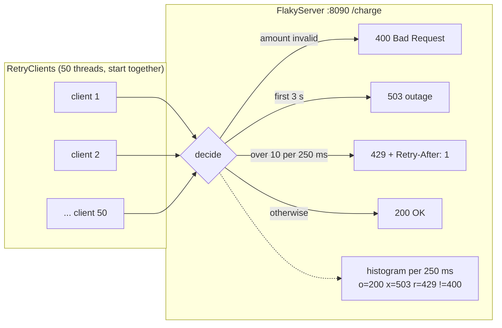
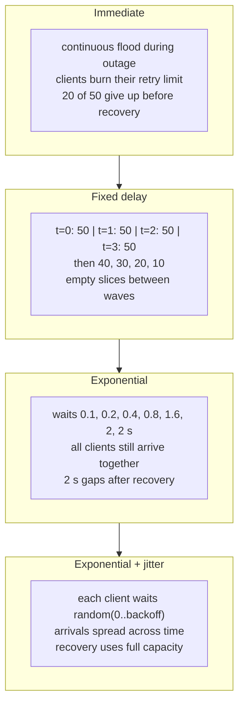
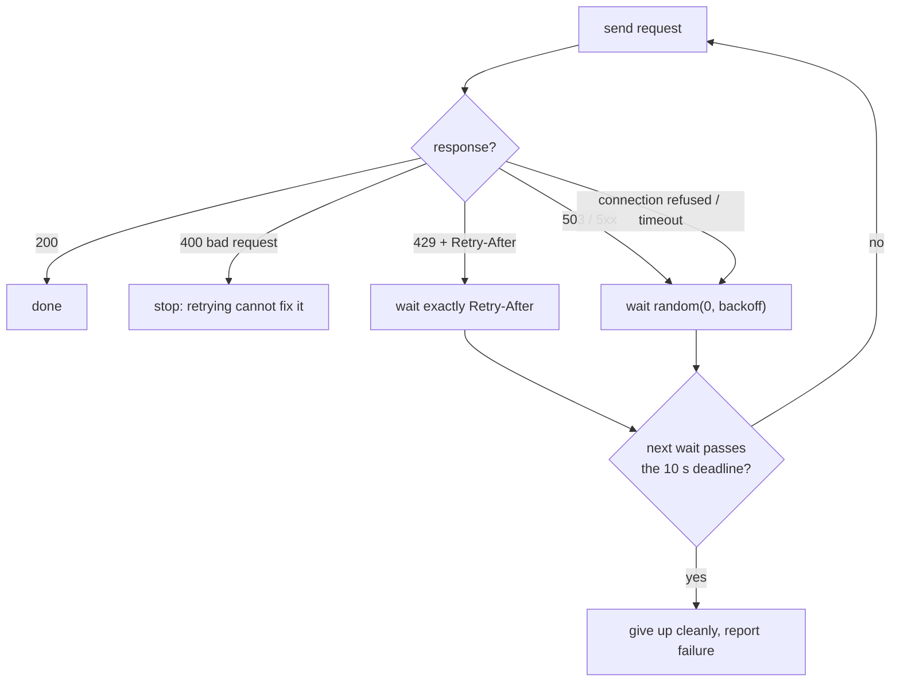

# 02 - Retry with exponential backoff and jitter

> **One line:** when a dependency fails, clients must retry in a way that **helps it recover**
> (fewer retries, spread out over time, only for errors that can succeed) instead of
> **keeping it down** with a retry storm.

POC 01 made retries **safe** (no double charge). This POC makes retries **polite**.

---

## 1. The problem (why this matters in distributed systems)

Every checkout calls other services: payment provider, tax, pricing, provisioning.
When one of them has a short outage, **thousands of in-flight requests fail at the same moment**
and all of them retry. How they retry decides whether the outage lasts 3 seconds or 30 minutes.

| Retry mistake | What it does to the struggling service |
|---|---|
| Retry immediately | Floods it with far more traffic than it can handle (**retry storm**) |
| Retry after a fixed delay | Everyone comes back at the same instant, in **synchronized waves** (**thundering herd**) |
| Retry everything | Wastes capacity on requests that can never succeed (e.g. 400 Bad Request) |
| Retry forever | Callers hang; threads and connections pile up |

---

## 2. The solution at a glance

1. **Exponential backoff:** wait longer after each failure: 100 ms, 200, 400, 800 ...
2. **Cap:** never wait more than a maximum (2 s here).
3. **Full jitter:** wait a **random** time between 0 and the backoff, so clients don't move in lockstep.
   `wait = random(0, min(cap, base * 2^(attempt-1)))`
4. **Classify errors:** retry only transient ones (503, connection refused, timeout);
   for 429 wait exactly the server's `Retry-After`; **never** retry 400.
5. **Time budget:** give up cleanly after a total deadline (10 s here).
6. **Idempotency first:** only retry operations that are safe to repeat (POC 01).

### Architecture of the experiment



The provider is **down for 3 s**, then healthy but limited to **40 requests per second**.
That limit is the key: a service that just recovered cannot absorb everyone at once.

---

## 3. The experiment: same outage, five retry strategies

Results from a real run (50 clients, Windows laptop):

| Strategy | Succeeded | Total requests | Time to finish | Shape on the provider |
|---|---|---|---|---|
| Immediate retry | **30 / 50** | **90,819** | 3.7 s | Constant flood (~25,000 req/s vs capacity 40/s) |
| Fixed 1 s | 50 / 50 | 300 | 7.2 s | Waves every second, idle capacity in between |
| Exponential (cap 2 s) | 50 / 50 | 400 | **11.3 s** | Fewer waves, still synchronized, slow recovery |
| Exponential + full jitter | 50 / 50 | 399 | **4.7 s** | Smooth trickle at about capacity |
| Smart (jitter + error rules + 10 s budget) | 45 / 50 * | ~360 | ~5 s | Smooth, bad requests fail fast |

\* 5 clients deliberately send an invalid amount: they get **400 and stop after 1 attempt** (correct behavior).

### What each strategy looks like over time



### Why each one behaves that way

- **Immediate:** retrying faster never helps a service that is down. The retries **are** the overload.
- **Fixed delay:** clients started together and wait the same time, so they **stay in sync forever**:
  overload and idle capacity alternate.
- **Exponential:** reduces **how many** retries hit a long outage, but does nothing about **when**:
  still waves, and long capped waits leave capacity unused after recovery.
- **Jitter:** randomness breaks the synchronization. Retries arrive as a steady trickle close to
  the provider's capacity, so almost every retry after recovery succeeds.

**Backoff controls *how many*. Jitter controls *when*. You need both.**

---

## 4. Which errors to retry (Step 7)



| Failure | Transient? | Action |
|---|---|---|
| 503 Service Unavailable | Yes | Backoff + jitter |
| Connection refused, timeout | Yes | Backoff + jitter |
| 429 Too Many Requests + `Retry-After` | Yes | Wait **exactly** what the server says |
| 400 Bad Request | **No** | **Never retry** |
| Total time budget used up | - | Stop and report |

With the provider **completely down**, the smart policy retried connection errors politely and
all 50 clients stopped at **~9.9 s**, just inside the 10 s budget, instead of hanging or quitting
after one attempt.

---

## 5. Distributed-systems concepts covered

| Concept | What it means | Where in this POC |
|---|---|---|
| **Transient vs permanent failure** | Some errors fix themselves, some never will | `payWithPolicy` status handling |
| **Retry storm** | Retries multiply load on a failing service | strategy `immediate` |
| **Thundering herd / synchronization** | Many clients act at the same instant | strategies `fixed`, `exponential` |
| **Exponential backoff** | Wait grows with each failure | `exponentialDelay()` |
| **Jitter (full jitter)** | Randomize waits to de-synchronize clients | `jitterDelay()` |
| **Cap** | Upper bound on a single wait | `MAX_DELAY_MS` |
| **Backpressure / Retry-After** | Server tells clients when to come back | 429 handling |
| **Deadline / time budget** | Bound total time spent on one operation | `TIME_BUDGET_MS` |
| **Capacity vs load** | A recovered service still has finite throughput | `CAPACITY_PER_SLICE` |
| **Idempotency prerequisite** | Only retry what is safe to repeat | POC 01 |

---

## 6. Code map

| File | Role |
|---|---|
| `FlakyServer.java` | The provider: outage, capacity limit, 429/400 rules, histogram per 250 ms |
| `RetryClients.java` | 50 concurrent clients; strategy chosen by argument |

Key methods in `RetryClients`:

| Method | Purpose |
|---|---|
| `payWithRetries(strategy)` | Steps 3-6: retry any non-200 with the chosen delay |
| `delayBeforeRetry(strategy, attempt)` | `immediate` / `fixed` / `exponential` / `jitter` |
| `exponentialDelay(attempt)` | `min(cap, base * 2^(attempt-1))` |
| `jitterDelay(attempt)` | `random(0, exponentialDelay(attempt))` |
| `payWithPolicy(amount)` | Step 7: error classification + Retry-After + deadline |

Java concepts used: `AtomicInteger` (thread-safe counters), `CountDownLatch` (start/finish gates),
`ThreadLocalRandom` (random numbers in concurrent code), `Optional` (`Retry-After` may be absent),
`HttpClient` / `HttpServer` (JDK built-in), method references (`FlakyServer::handle`, `Math::max`).

---

## 7. Build history (one commit per step)

| Step | What was built | What it showed |
|---|---|---|
| 1 | Maven skeleton, no dependencies | - |
| 2 | `FlakyServer` with outage, capacity, histogram | A repeatable test lab |
| 3 | `immediate` | Retry storm: 90k requests, 20 clients lost |
| 4 | `fixed` | Synchronized waves + idle capacity |
| 5 | `exponential` | Fewer retries but still waves, slow recovery |
| 6 | `jitter` | Smooth arrivals, fastest recovery |
| 7 | `smart` policy | Retry only transient errors, honor Retry-After, 10 s budget |

---

## 8. How to run (Windows PowerShell, inside `02-retry-backoff`)

```powershell
# Terminal 1: the provider (restart after changing FlakyServer.java)
mvn -q compile exec:java "-Dexec.mainClass=com.teja.pocs.retry.FlakyServer"

# Terminal 2: one strategy at a time
mvn -q compile exec:java "-Dexec.mainClass=com.teja.pocs.retry.RetryClients" "-Dexec.args=jitter"

# or compare all of them (server prints one chart per run)
foreach ($s in "immediate","fixed","exponential","jitter","smart") {
  mvn -q exec:java "-Dexec.mainClass=com.teja.pocs.retry.RetryClients" "-Dexec.args=$s"
  Start-Sleep -Seconds 4
}
```

---

## 9. Interview prep: questions and crisp answers

**Q1. Why not just retry immediately?**
A failing service is usually overloaded or restarting. Immediate retries multiply its load
(here ~25,000 req/s against a capacity of 40/s) and can keep it down. In the experiment it also
made 20 of 50 clients give up before the service even recovered.

**Q2. What is exponential backoff and what problem does it solve?**
Each retry waits longer: base * 2^n, capped. It reduces **how many** retries hit a service during a
long outage, giving it room to recover.

**Q3. Why is exponential backoff alone not enough?**
Clients that fail together compute the same waits and come back together: synchronized waves.
Capacity is overloaded at each wave and idle between them. Jitter fixes the timing.

**Q4. What is jitter? Which kind?**
Randomizing the wait. Full jitter = `random(0, backoff)`. It spreads retries out so the
arrival rate stays near the service's capacity. Here it cut recovery from 11.3 s to 4.7 s.

**Q5. Which errors should you retry?**
Transient ones: 503, other 5xx, connection refused, timeouts. 429: yes, but after `Retry-After`.
Never 4xx like 400/401/403/404, because the request itself is wrong.

**Q6. Why respect `Retry-After`?**
The server knows its own state better than the client's formula. It's a form of backpressure.

**Q7. How do you stop retrying?**
A max number of attempts and/or a total time budget (deadline). Check the budget **before**
sleeping, and propagate deadlines downstream so inner calls don't outlive the caller.

**Q8. Is it safe to retry a payment?**
Only if the operation is idempotent: same idempotency key on every retry (POC 01).
Retry policy and idempotency are two halves of the same design.

**Q9. Where else do retries multiply?**
In layered systems each layer retrying 3 times gives 3 x 3 x 3 = 27 calls at the bottom.
Retry at one layer (usually the outermost or the one closest to the failure), not all of them.

**Q10. What comes after retries?**
If a dependency keeps failing, stop calling it for a while: **circuit breaker**.
On the server side, protect yourself from too many callers: **rate limiting** (next POC).

---

## 10. Limits of this POC

- One machine: localhost latency is tiny, so real-world numbers will differ (the shapes won't).
- The provider resets its clock per run; real outages are not this tidy.
- Clients don't share information; production systems also use circuit breakers and retry budgets
  shared across a whole service (e.g. "retries may add at most 10% extra load").
- Full jitter only; other variants exist (equal jitter, decorrelated jitter).

---

## 11. References

- Retry pattern (Azure Architecture Center): https://learn.microsoft.com/azure/architecture/patterns/retry
- Circuit Breaker pattern: https://learn.microsoft.com/azure/architecture/patterns/circuit-breaker
- Rate Limiting pattern: https://learn.microsoft.com/azure/architecture/patterns/rate-limiting-pattern
