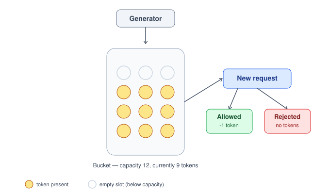
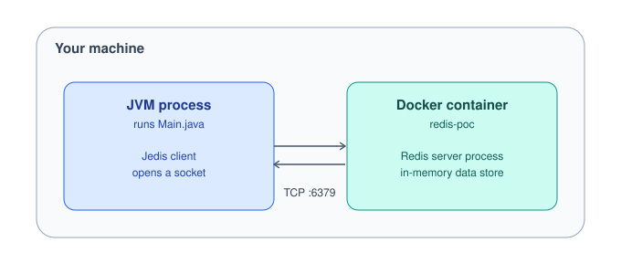

# Redis Token Bucket Rate Limiter (POC)


A small, hands-on proof-of-concept implementing the **token bucket algorithm**
for request rate limiting, backed by **Redis** as the shared state store —
including a concurrency-safe version using **atomic Lua scripting**.

Built as a learning lab to understand *how* Redis is actually used in
real-world rate limiting — not just as a cache, but as a fast, shared,
atomic state store across multiple application instances.

---

## Table of Contents

- [Why Redis for Rate Limiting?](#why-redis-for-rate-limiting)
- [How the Algorithm Works](#how-the-algorithm-works)
- [Architecture](#architecture)
- [Prerequisites](#prerequisites)
- [Setup](#setup)
- [Project Structure](#project-structure)
- [Demo: Bursty Traffic Simulation](#demo-bursty-traffic-simulation)
- [Solving the Race Condition with Lua](#solving-the-race-condition-with-lua)
- [Proving Atomicity: Concurrency Test](#proving-atomicity-concurrency-test)
- [Inspecting State Directly in Redis](#inspecting-state-directly-in-redis)
- [Known Limitations / Next Steps](#known-limitations--next-steps)

---

## Why Redis for Rate Limiting?

Redis is usually thought of as a cache, but the properties that make it
good at caching are exactly what make it useful for rate limiting too:

| Property | Why it matters for rate limiting |
|---|---|
| **Speed** | In-memory reads/writes in sub-millisecond time — adds negligible latency per request. |
| **Shared state across instances** | If an app runs on multiple servers behind a load balancer, an in-memory counter on each instance would let a user bypass limits by hitting different servers. Redis gives every instance one shared source of truth per user. |
| **Atomicity (via Lua)** | Prevents race conditions when concurrent requests check/update the same counter at the same instant — see [below](#solving-the-race-condition-with-lua). |
| **TTL / expiry** | Idle users' bucket keys can expire automatically instead of growing forever. |

---

## How the Algorithm Works

Each user has a "bucket" of tokens, capped at a fixed **capacity**, that
refills at a steady **rate** over time. Every incoming request tries to
consume one token:

- ✅ Token available → request **allowed**, bucket loses 1 token
- ❌ Bucket empty → request **rejected**

This lets short bursts of traffic through (up to capacity) while still
enforcing a steady average rate over time.



### State stored per user

Stored as a Redis **hash** under key `bucket:<userId>`:

| Field | Meaning |
|---|---|
| `tokens` | Current token count |
| `capacity` | Max tokens the bucket can hold |
| `refill_rate_per_sec` | Tokens added per second |
| `last_refill_timestamp` | Epoch millis of the last time this bucket was updated |

### The 6 steps, run on every request

1. Read current state from Redis (or initialize a full bucket if this is the user's first request)
2. Compute elapsed time since `last_refill_timestamp`
3. Compute tokens earned during that elapsed time (`elapsed_seconds × refill_rate_per_sec`)
4. Cap the refill at `capacity` → `new_tokens = min(capacity, tokens + earned)`
5. If `new_tokens >= 1` → allow, decrement by 1; else → reject
6. Persist the updated state back to Redis

> **Refill is lazy** — it's only computed when a request actually checks
> the bucket, never on a background timer. Idle time still "banks"
> tokens; they just aren't reflected in Redis until the next request
> recalculates.

---

## Architecture



Jedis is **not** Redis itself — it's a client library. It translates Java
method calls (`jedis.hset(...)`) into Redis's RESP protocol over a plain
TCP socket, and translates Redis's replies back into Java objects.

---

## Prerequisites

- [Docker](https://docs.docker.com/get-docker/)
- Java 17+
- Maven (optional if using VS Code with the **Extension Pack for Java** — it can build/run without `mvn` on your system PATH)

## Setup

1. **Start Redis in Docker:**
   ```bash
   docker run -d --name redis-poc -p 6379:6379 redis:7-alpine
   ```

2. **Verify it's running:**
   ```bash
   docker exec -it redis-poc redis-cli ping
   # → PONG
   ```

3. **Clone this repo and open it in your IDE.**

4. **Run `Main.java`** — via your IDE's Run button, or:
   ```bash
   mvn compile
   mvn exec:java -Dexec.mainClass="com.poc.Main"
   ```

---

## Project Structure

```
redis-token-bucket-poc/
├── pom.xml
├── README.md
├── .gitignore
└── src/
    └── main/
        └── java/
            └── com/
                └── poc/
                    ├── Main.java                # Demo: simulates bursty traffic t0-t4
                    ├── TokenBucketLimiter.java   # Core rate limiting logic (atomic, Lua-backed)
                    └── ConcurrencyTest.java      # Proves atomicity under concurrent load
```

---

## Demo: Bursty Traffic Simulation

`Main.java` replays a traffic pattern across 5 time windows with a bucket
of **capacity 10**, refilling at **2 tokens/sec**:

| Time | Requests | Result |
|---|---|---|
| t0 | 3 | all allowed |
| t1 | 1 | allowed |
| t2 | 12 | 9 allowed, **3 rejected** (burst exceeds capacity) |
| t3 | 0 | idle — no computation happens at all |
| t4 | 4 | all allowed (idle time banked extra tokens) |

**Sample output:**
```
--- t0: 3 requests ---
Request 1: ALLOWED  (tokens now: 9.0)
Request 2: ALLOWED  (tokens now: 8.0)
Request 3: ALLOWED  (tokens now: 7.0)
--- t1: 1 request ---
Request 1: ALLOWED  (tokens now: 8.99...)
--- t2: 12 requests ---
Request 1: ALLOWED   (tokens now: 9.99...)
...
Request 10: ALLOWED  (tokens now: 0.0...)
Request 11: REJECTED (tokens now: 0.0)
Request 12: REJECTED (tokens now: 0.0)
--- t3: idle, no requests ---
--- t4: 4 requests ---
Request 1: ALLOWED  (tokens now: 2.99...)
...
```

---

## Solving the Race Condition with Lua

**The problem:** if `allowRequest()` does `HGETALL` → compute → `HSET` as
three separate Redis calls, two near-simultaneous requests from the same
user (e.g. from two different app server instances) could both read
`tokens=1`, both decide "allow," and both decrement — letting **2**
requests through on a budget of **1** token.

**The fix:** move the entire read → compute → write sequence into a
single **Lua script**, executed via Redis's `EVAL`. Redis runs Lua
scripts to completion, single-threaded, before processing any other
client's command — making the whole operation atomic.

```lua
-- KEYS[1] = bucket key, e.g. "bucket:user123"
-- ARGV[1] = capacity
-- ARGV[2] = refill_rate_per_sec
-- ARGV[3] = now (epoch millis)

local key = KEYS[1]
local capacity = tonumber(ARGV[1])
local refillRate = tonumber(ARGV[2])
local now = tonumber(ARGV[3])

local state = redis.call('HMGET', key, 'tokens', 'last_refill_timestamp')
local tokens = tonumber(state[1])
local lastRefillTimestamp = tonumber(state[2])

if tokens == nil then
    tokens = capacity
    lastRefillTimestamp = now
end

local elapsedSeconds = (now - lastRefillTimestamp) / 1000.0
local tokensToAdd = elapsedSeconds * refillRate
local newTokens = math.min(capacity, tokens + tokensToAdd)

local allowed = 0
if newTokens >= 1 then
    allowed = 1
    newTokens = newTokens - 1
end

redis.call('HSET', key,
    'tokens', tostring(newTokens),
    'capacity', tostring(capacity),
    'refill_rate_per_sec', tostring(refillRate),
    'last_refill_timestamp', tostring(now))

return allowed
```

The Java-facing API (`limiter.allowRequest(userId)`) is unchanged — the
atomicity fix is entirely internal.

---

## Proving Atomicity: Concurrency Test

`ConcurrencyTest.java` fires **20 concurrent requests** at a bucket with
**capacity 5**, using a thread pool:

```bash
mvn exec:java -Dexec.mainClass="com.poc.ConcurrencyTest"
```

**Expected output, every single run:**
```
Allowed: 5 out of 20 (capacity was 5)
```

With the non-atomic (three-call) version, this number is **flaky** —
you'd see 6, 7, or more allowed depending on thread timing. With the Lua
version, it's exactly 5, every time, proving the race condition is closed.

---

## Inspecting State Directly in Redis

You can watch the bucket's state update live using `redis-cli`, from any
terminal, independent of the Java app:

```bash
docker exec -it redis-poc redis-cli
HGETALL bucket:user123
```

```
1) "tokens"
2) "7.0"
3) "capacity"
4) "10"
5) "refill_rate_per_sec"
6) "2.0"
7) "last_refill_timestamp"
8) "1758198012345"
```

---

## Known Limitations / Next Steps

- **No key expiry (TTL) yet** — bucket keys persist forever. In
  production, idle users' keys should expire automatically to avoid
  unbounded memory growth.
- **Single Redis instance** — no failover/clustering considered; a POC
  simplification, not production-ready as-is.
- **No app-layer integration** — this POC calls `TokenBucketLimiter`
  directly from `Main.java`. A natural next step would be wiring it into
  an actual HTTP filter/middleware (e.g. a Spring Boot interceptor) so it
  rejects real incoming requests with a `429 Too Many Requests` response.

---

## What This POC Demonstrates

- Practical Redis usage beyond simple caching (hashes, Lua scripting via `EVAL`)
- The token bucket rate-limiting algorithm, implemented and traced by hand
- Diagnosing and fixing a real concurrency race condition
- Clean separation of algorithm (`TokenBucketLimiter`), driver code (`Main`), and verification (`ConcurrencyTest`)
